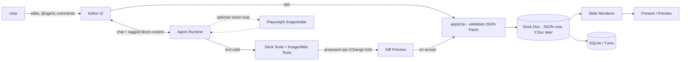
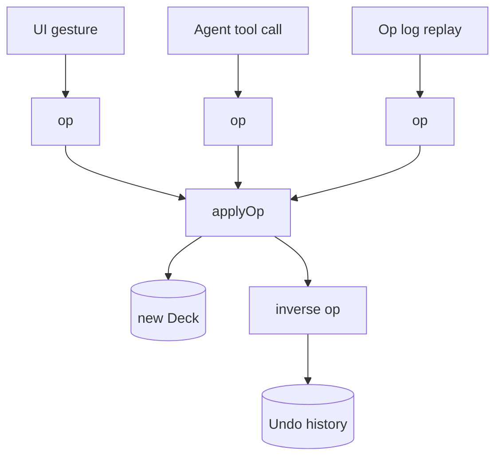
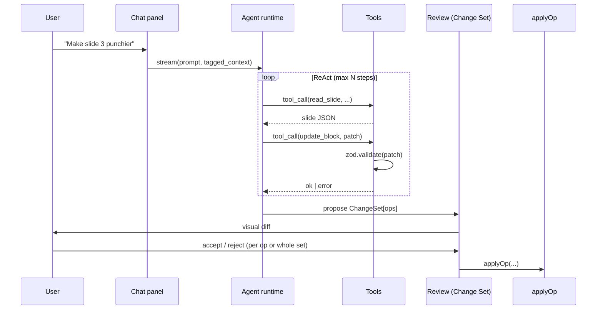
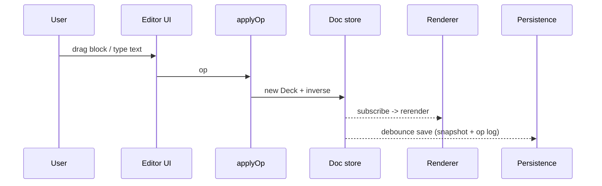
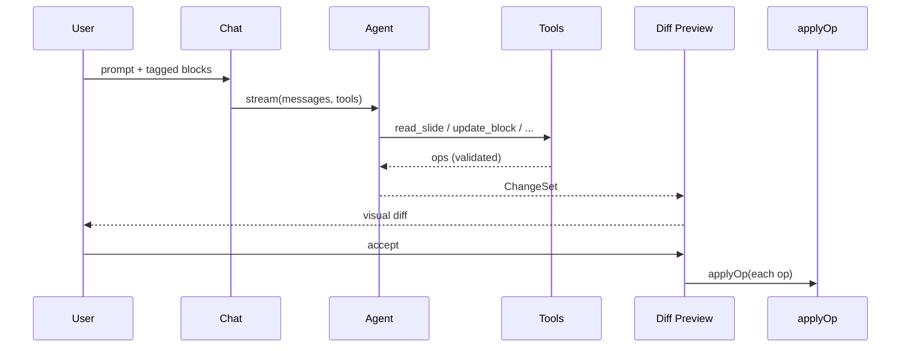
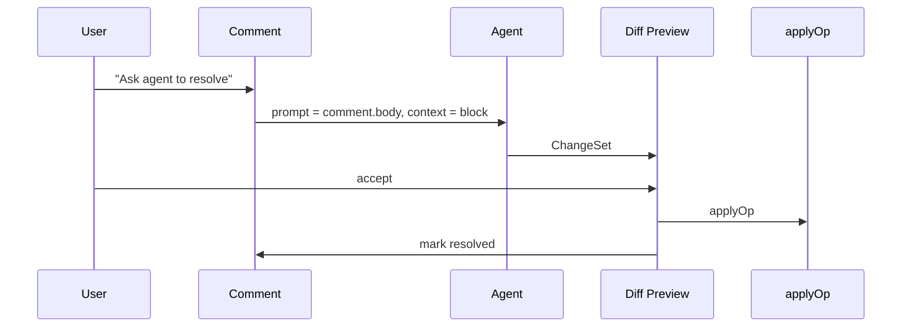
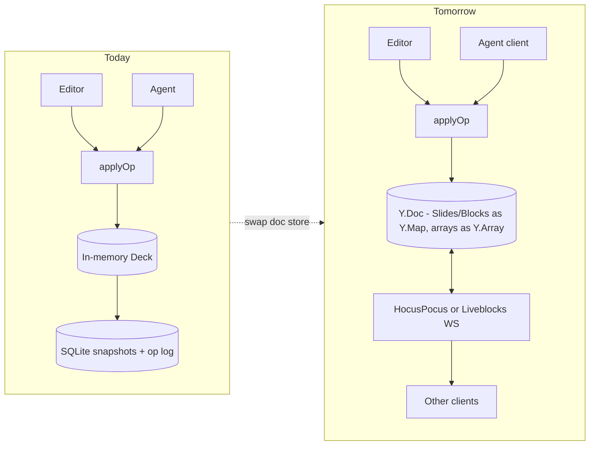

# better_slido

> An open-source presentation co-worker. Draft slides in your browser next to an always-on agent you can `@`-tag, comment on blocks, and accept/reject edits from — like pair-programming, but for decks.

**Status:** pre-alpha · architecture & plan document · code not yet written.
**License:** MIT (intended).

---

## Table of contents

1. [What this is](#1-what-this-is)
2. [Goals & non-goals](#2-goals--non-goals)
3. [Core architectural decisions](#3-core-architectural-decisions)
4. [High-level architecture](#4-high-level-architecture)
5. [Document model](#5-document-model)
6. [Ops layer (the single mutation choke point)](#6-ops-layer-the-single-mutation-choke-point)
7. [Slide renderer](#7-slide-renderer)
8. [Agent runtime](#8-agent-runtime)
9. [Collaboration & tagging UX](#9-collaboration--tagging-ux)
10. [Data flows](#10-data-flows)
11. [Security model](#11-security-model)
12. [Tech stack](#12-tech-stack)
13. [Repository layout](#13-repository-layout)
14. [Configuration & BYOK](#14-configuration--byok)
15. [Local development](#15-local-development)
16. [Roadmap & milestones](#16-roadmap--milestones)
17. [Multi-user (CRDT) migration path](#17-multi-user-crdt-migration-path)
18. [Performance considerations](#18-performance-considerations)
19. [Risks & mitigations](#19-risks--mitigations)
20. [Contributing](#20-contributing)

---

## 1. What this is

`better_slido` is a browser-based slide editor with an in-app AI agent that behaves like a hackathon teammate:

- You drag blocks, type, paste images, write code blocks.
- The agent sits in a side panel. You can `@agent` it, right-click any block to ask for edits, or leave inline comments that the agent resolves.
- Every agent edit is a **structured patch**, previewed as a visual diff, then accepted or rejected.
- You present in-browser and export to PDF / PPTX.
- It's BYOK: bring your own OpenAI / Anthropic / Gemini / OpenAI-compatible local key.

It's designed to be **self-hostable** and **easy to fork**: a single Next.js app you can run with `pnpm dev`, plus a few well-isolated packages.

## 2. Goals & non-goals

**Goals**

- Make AI edits **reliable**: structured JSON-Patch tool calls, validated by Zod, applied through one mutation choke point.
- Make AI edits **reviewable**: every change set is a visual diff before it lands.
- Keep design **flexible**: a structured block model for 90% of cases, plus an HTML/JSX escape hatch in a sandboxed iframe for custom designs.
- Be **CRDT-ready**: ship single-user first, but architect the doc so multi-user real-time collab is a later swap, not a rewrite.
- Be **open-source friendly**: MIT, BYOK, `docker compose up`, one-click Vercel template, ADRs for every important decision.

**Non-goals (for v1)**

- Full Figma-level free-form vector editing.
- Real-time co-editing on day one (architected for, not shipped on, v1).
- Hosted SaaS billing.
- Mobile-first editing (we target desktop; presentation mode is fine on any device).

## 3. Core architectural decisions

These are locked. Everything else should be consistent with them.

- **D1 — Hybrid slide model.** Slides are JSON `Deck { slides: Slide[] }` where each `Slide` has typed `Block`s (title, text, bullets, image, code, chart, shape) plus an `HtmlBlock` escape hatch.
- **D2 — Single mutation choke point.** Nothing — not the UI, not the agent, not undo/redo — mutates the document outside `applyOp(deck, op)`. Ops are RFC 6902 JSON Patches restricted to known paths.
- **D3 — Agent edits are tool calls returning ops, not text.** The agent never returns a "new deck blob". It returns a list of patches that go through the same `applyOp` the UI uses.
- **D4 — Single-user MVP, CRDT-ready model.** The doc store is swappable. Today: in-memory + SQLite. Tomorrow: Y.Doc + HocusPocus/Liveblocks, with the agent as just another client.
- **D5 — BYOK + multi-provider.** Provider chosen at runtime from env. No vendor lock-in to a single LLM.

## 4. High-level architecture



Component responsibilities at a glance:

- **Editor UI** — React tree that turns user gestures into ops; never writes to the doc directly.
- **Ops layer** — pure functions: `applyOp(deck, op) -> { deck, inverse }`. Source of truth for mutation semantics.
- **Doc store** — owns the current `Deck`; broadcasts changes to subscribers. Swappable backend (in-memory now, Y.Doc later).
- **Renderer** — pure React; given a `Deck`, draws slides and present mode. Has zero editor state.
- **Agent runtime** — streams from the LLM, invokes tools, builds a Change Set of proposed ops, hands it to the Diff Preview UI.
- **Snapshotter** — server-side Playwright that renders a slide to PNG for the agent's vision self-check loop.
- **Persistence** — Prisma + SQLite (local) or libSQL/Turso (hosted). Stores deck snapshots + op log + comments.

## 5. Document model

Defined in `packages/deck-schema` as Zod schemas; TypeScript types are inferred. IDs are nanoids; positions reference a fixed 1920x1080 canvas plus an optional 12-col responsive grid for safer agent edits.

```ts
type Deck = {
  id: string
  title: string
  theme: ThemeRef            // id into themes registry
  slides: Slide[]
  meta: { createdAt; updatedAt; version: number }
}

type Slide = {
  id: string
  layout: LayoutId           // "title", "two-col", "full-bleed", "blank", ...
  background?: BackgroundSpec
  blocks: Block[]
  notes: string              // speaker notes
  comments: Comment[]
}

type Block =
  | TitleBlock
  | TextBlock
  | BulletsBlock
  | ImageBlock
  | CodeBlock
  | ChartBlock
  | ShapeBlock
  | HtmlBlock                // escape hatch, sandboxed iframe

type BlockBase = {
  id: string
  type: Block['type']
  frame: { x; y; w; h }      // px on 1920x1080 canvas
  grid?: { col; row; colSpan; rowSpan }
  style?: StyleOverrides
  z?: number
}

type Comment = {
  id: string
  blockId: string
  range?: { from: number; to: number }   // optional text-range anchor
  author: 'user' | 'agent'
  body: string
  resolved: boolean
  createdAt: number
}
```

Why this shape:

- **Typed blocks** make agent edits structured and previewable.
- **`HtmlBlock`** preserves creative freedom without forcing every layout into the schema.
- **Comments anchored to `blockId`** survive edits to the block's content as long as the block exists; range anchoring is best-effort with text-position rebasing on text edits.

## 6. Ops layer (the single mutation choke point)

`packages/deck-ops` exposes exactly one mutation entry point:

```ts
applyOp(deck: Deck, op: Op): { deck: Deck; inverse: Op }
```

- `Op` is a discriminated union of high-level ops (`InsertBlock`, `UpdateBlock`, `DeleteBlock`, `ReorderSlides`, `ApplyTheme`, …), each compiled to a sequence of RFC 6902 JSON Patches under the hood.
- Inverses enable undo/redo "for free" — the editor history is just a stack of inverses.
- The same `applyOp` is used by UI gestures, agent tool calls, and replay-from-log.
- A lint rule (and CR checklist) forbids any other file from mutating `deck.*` directly. This is what unlocks the future CRDT swap.



## 7. Slide renderer

`packages/slide-renderer` is a pure React module: given a `Deck` and a `slideIndex`, it draws.

- One component per block type. Code uses Shiki, charts use Recharts, math uses KaTeX, icons are Lucide.
- Themes are CSS variables plus a `theme.json` (palette, typography, radii, spacing scale).
- Present mode is a minimal in-house implementation: keyboard nav, fullscreen, speaker notes window, no full reveal.js dependency.
- **`HtmlBlock`** renders into `<iframe sandbox srcdoc={html}>` with a strict CSP — see [Security model](#11-security-model).

The renderer has **zero editor state**. The same component tree is used in the editor canvas, the slide rail, the diff preview, the snapshotter, and the export pipeline.

## 8. Agent runtime

Implemented in `apps/web/lib/agent` on top of the Vercel AI SDK.

### 8.1 Loop



### 8.2 Tool catalog

All tools return Zod-validated payloads. Mutating tools return **proposed ops**, not applied ones.

- `read_deck() / read_slide(id)` — read-only views, scoped to tagged context when possible.
- `create_slide({ at, layout, blocks? }) -> Op`
- `delete_slide({ id }) -> Op`
- `reorder_slides({ order: id[] }) -> Op`
- `insert_block({ slideId, block, at? }) -> Op`
- `update_block({ slideId, blockId, patch }) -> Op`
- `delete_block({ slideId, blockId }) -> Op`
- `apply_theme({ themeId }) -> Op`
- `set_layout({ slideId, layout }) -> Op`
- `search_image({ query, source: 'unsplash'|'pexels' }) -> { url, attribution }`
- `generate_image({ prompt, model? }) -> { url }` (optional, BYOK)
- `web_search({ query }) -> { results }` (optional)
- `render_snapshot({ slideId }) -> { pngUrl }` — server Playwright; enables vision self-check.

### 8.3 Context discipline

- Default context: the currently focused slide + any explicitly tagged blocks + a deck-level summary the agent maintains.
- Never auto-send the whole deck; large decks would blow tokens and degrade edits.
- The agent keeps a short "deck memory" (titles + 1-line summary per slide) refreshed on accept.

### 8.4 Vision self-check (optional)

After large rewrites, the agent calls `render_snapshot` and re-evaluates "does this look like what the user asked for?" with a vision-capable model. If not, it proposes a follow-up op set. This is gated behind a setting because it costs tokens.

## 9. Collaboration & tagging UX

- **Always-on chat panel** (right side, collapsible). Streaming tokens, visible tool calls (Cursor-style), per-tool expandable details.
- **Block tagging.** Right-click any block → "Ask agent…" pre-fills chat with a reference like `#slide-2/bullets-1`. Mentions are first-class: typing `@b/<id>` autocompletes from the current deck.
- **Inline comments.** Sticky-note style anchored to a `blockId` (plus optional text range). Each comment has "Ask agent to resolve" → spawns an agent turn scoped to that block.
- **Slash commands** in chat:
  - `/outline <topic>` — draft a deck outline
  - `/new-slide [layout] [topic]`
  - `/theme <vibe>` — propose a theme change (preview first)
  - `/rewrite shorter | crisper | for-execs`
  - `/image <prompt>`
- **Change Set diff modal.** Before any agent ops land, you see before/after slide thumbnails with per-op accept/reject toggles.

## 10. Data flows

### 10.1 User edit flow



### 10.2 Agent edit flow



### 10.3 Comment resolution flow



## 11. Security model

The biggest non-obvious risk is the `HtmlBlock` escape hatch. Mitigations:

- Rendered in `<iframe sandbox srcdoc={html}>` with sandbox flags chosen to **exclude `allow-same-origin`** by default.
- Strict `Content-Security-Policy` injected into the iframe srcdoc: `default-src 'none'; img-src data: https:; style-src 'unsafe-inline'; script-src 'none'`. Scripts are opt-in per block via a visible "Trust scripts in this block" toggle; even then, no same-origin.
- HTML is also passed through DOMPurify before being placed in `srcdoc`, with an allowlist tuned to the renderer's needs.
- **Agent-generated HTML** is treated identically to user-pasted HTML — no special trust.
- API keys never reach the browser. The agent runs server-side; the browser talks to a Next.js Route Handler that holds the keys (or, in BYOK-frontend mode, encrypts user-provided keys in IndexedDB and forwards them only on each request).

## 12. Tech stack

- **Frontend:** Next.js 15 (App Router), React 19, TypeScript, Tailwind v4, shadcn/ui, Zustand (editor state), dnd-kit (drag/resize), Framer Motion (transitions), Shiki (code), Recharts (charts), KaTeX (math), Lucide (icons).
- **Agent:** Vercel AI SDK with tool calls + streaming; provider chosen by env (OpenAI / Anthropic / Google / OpenAI-compatible local).
- **Backend:** Next.js Route Handlers (Edge runtime for the streaming chat endpoint, Node runtime for snapshot/export). Prisma + SQLite locally; libSQL/Turso for hosted.
- **Snapshots / export:** Playwright (or `@sparticuz/chromium` on serverless) for slide → PNG / PDF; `pptxgenjs` for PPTX.
- **Storage:** local filesystem in dev; S3/R2 swappable in prod.
- **Auth:** none in MVP. Auth.js scaffolded behind a flag for the multi-user phase.

## 13. Repository layout

```
better_slido/
  apps/
    web/                          # Next.js app
      app/
        page.tsx                  # landing / deck list
        d/[deckId]/page.tsx       # editor
        present/[deckId]/page.tsx # present mode
        api/
          agent/route.ts          # streaming chat + tools (Edge)
          snapshot/route.ts       # Playwright (Node)
          export/route.ts         # PDF/PPTX (Node)
      components/
        editor/                   # canvas, inspector, slide rail
        chat-panel/               # chat UI, tool-call display, diff modal
        comments/                 # inline comments + threads
        slide-renderer/           # thin wrapper around the package
      lib/
        agent/                    # tool definitions, prompts, run loop
        deck/                     # client-side doc store + hooks
        persistence/              # prisma client + autosave
      prisma/
      public/
  packages/
    deck-schema/                  # Zod types (shared)
    deck-ops/                     # applyOp + inverses (CRDT-ready)
    slide-renderer/               # pure renderer + themes
    agent-tools/                  # tool implementations
  docs/
    adr/                          # architecture decision records
    screenshots/
  examples/                       # example decks
  pnpm-workspace.yaml
  docker-compose.yml
  README.md  LICENSE  CONTRIBUTING.md
```

Pragmatically: start as a single Next.js app under `apps/web` and split out `packages/*` only when interfaces stabilize (end of M2). Premature monorepo-ification slows the first month down.

## 14. Configuration & BYOK

All config via env vars. Example `.env.example`:

```bash
# Pick one or more providers; the first set one is the default.
OPENAI_API_KEY=
ANTHROPIC_API_KEY=
GOOGLE_GENERATIVE_AI_API_KEY=
OPENAI_COMPATIBLE_BASE_URL=          # e.g. http://localhost:11434/v1 for Ollama
OPENAI_COMPATIBLE_API_KEY=

# Optional tools
UNSPLASH_ACCESS_KEY=
PEXELS_API_KEY=
TAVILY_API_KEY=                       # web_search

# Persistence
DATABASE_URL=file:./dev.db            # or libsql://...
STORAGE_BACKEND=local                 # local | s3
S3_BUCKET=
S3_REGION=
S3_ACCESS_KEY_ID=
S3_SECRET_ACCESS_KEY=

# Snapshots
PLAYWRIGHT_MODE=local                 # local | serverless
```

Frontend BYOK mode (optional): user pastes a key in Settings, it's stored encrypted in IndexedDB and forwarded on each request rather than living on the server.

## 15. Local development

```bash
pnpm install
pnpm prisma migrate dev
pnpm --filter web dev
# in a second terminal, if you want the snapshot service:
pnpm --filter web playwright install chromium
```

Or, full stack via Docker:

```bash
docker compose up
```

## 16. Roadmap & milestones

Roughly six weeks part-time.

- **M0 — Foundations.** Next.js scaffold; Zod schemas for `Deck`/`Slide`/`Block`; renderer for Title/Text/Bullets/Image/Code/Chart; hardcoded sample deck; minimal Present mode.
- **M1 — Editor MVP.** dnd-kit drag + resize; block inspector; slide thumbnail rail; `applyOp` + inverses for undo/redo; Prisma + SQLite persistence; autosave.
- **M2 — Agent v1.** Chat panel with streaming + visible tool calls; tools for `read_*`, `create_slide`, `insert_block`, `update_block`, `delete_block`, `reorder_slides`; Change Set diff modal with per-op Accept/Reject.
- **M3 — Collab UX.** Right-click `@agent` block tagging; inline comments anchored to `blockId` with "Ask agent to resolve"; slash commands (`/outline`, `/new-slide`, `/theme`, `/rewrite`, `/image`); `search_image` tool.
- **M4 — Polish + visual loop.** Theme system (CSS vars + `theme.json`); Playwright snapshot service; optional agent vision self-check; PDF/PPTX export; `HtmlBlock` escape hatch with sandboxed iframe + strict CSP.
- **M5 — CRDT + deploy.** Wrap doc store in Y.Doc behind a flag; optional HocusPocus or Liveblocks server; Auth.js; `docker-compose`; ADRs; public Vercel template.

## 17. Multi-user (CRDT) migration path

Single-user today, but the model is built so we can flip a switch later.



What changes when we flip the switch:

- `applyOp` becomes the only translator between high-level `Op`s and Y.Doc mutations.
- The agent becomes "just another client" submitting `Op`s over the wire.
- Comments and presence ride on Y.js awareness.
- Persistence is the Y.js update log; SQLite snapshots become a periodic dump for export and disaster recovery.

What does **not** change: the document schema, the renderer, the tool catalog, the diff preview UX, the chat panel.

## 18. Performance considerations

- **Big decks:** virtualize the slide rail; lazy-render off-screen slide canvases; memoize block components by `blockId + version`.
- **Streaming:** the chat endpoint runs on Edge for sub-200ms TTFB on stream start.
- **Snapshots:** Playwright runs out-of-process; results are cached by `(slideId, deckVersion)` so repeated vision checks are cheap.
- **Token budget:** context selector clamps payloads to ≤ ~6k tokens by default and degrades gracefully (drops to slide-only) on very large decks.
- **Op log:** trimmed when a new snapshot is written; full history kept only for the active session.

## 19. Risks & mitigations

- **Unreliable AI edits** → tool calls only, Zod validation on every tool output, retry-with-error loop, JSON-Patch only.
- **HTML escape-hatch XSS** → sandboxed iframe, no `allow-same-origin`, strict CSP, DOMPurify, opt-in scripts with a visible trust toggle.
- **Token blow-up on large decks** → context selector, deck summary memory, slide-level scoping.
- **CRDT migration cost** → enforce "no mutation outside `applyOp`" via lint + code review from day one.
- **Provider drift / lock-in** → AI SDK abstraction; provider is an env var; tool schemas are independent of provider.
- **Export fidelity (PPTX)** → ship PDF first (Playwright print), PPTX second via `pptxgenjs` with a curated subset of block features; document limitations.

## 20. Contributing

- Conventional commits, PR-per-feature, ADR for any decision that touches schema, ops, or agent contract.
- A change touching `deck-schema` or `deck-ops` requires a paired migration note in `docs/adr/`.
- No mutation of `deck.*` outside `packages/deck-ops` — enforced via lint and review.
- Add example decks under `examples/` when you add new block types or layouts.

---

### Appendix A — Glossary

- **Block** — typed unit of content on a slide (title, text, bullets, image, code, chart, shape, html).
- **Op** — high-level intent (e.g. `InsertBlock`); compiles to one or more RFC 6902 JSON Patches.
- **Change Set** — a batch of ops produced by one agent turn, presented as a single diff to accept/reject.
- **Tagged context** — the slides/blocks explicitly referenced by the user (`#slide-2/bullets-1`) that the agent receives in addition to deck summary.
- **Escape hatch** — `HtmlBlock`, the structured-schema bypass for custom designs, rendered in a sandboxed iframe.
