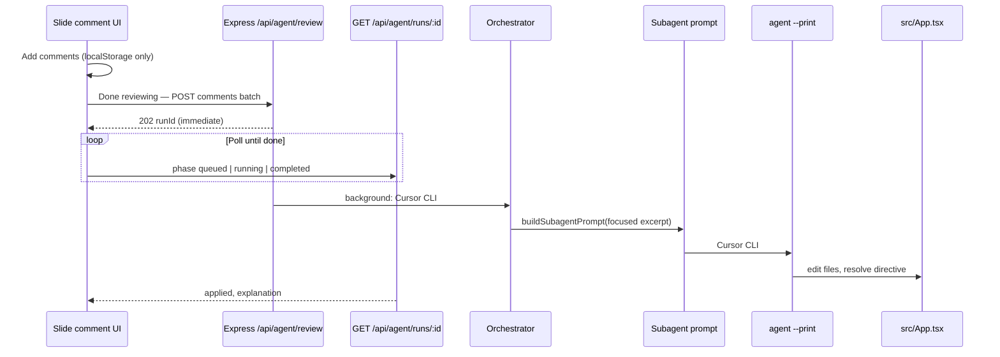

# Cursor CLI agent architecture

Better Slido’s backend uses the **Cursor Agent CLI** (`agent` on PATH), not the Gemini Antigravity remote sandbox.

## Flow



Comments are **saved instantly** in the browser. The Cursor CLI runs when:

1. **Any comment is posted** on the slide (auto-queues; server prepends `@agent` if omitted), or
2. The user clicks **Re-run agent on this slide** / **Run agent** in a comment popover, or
3. A client calls `POST /api/agent/review` directly.

The agent edits `src/App.tsx`, then the run moves to **`awaiting_review`** with `preFields` + `postFields` attached. The UI shows a before/after diff and the user clicks **Accept suggestion** or **Reject**.

- **Accept** → `POST /api/agent/runs/:runId/accept` → deck state syncs from the (already-modified) file, comments resolve, run becomes `completed`.
- **Reject** → `POST /api/agent/runs/:runId/reject` → server restores the pre-run snapshot of `src/App.tsx`, deck never changed, run becomes `rejected`.

While a slide is in review, the Vite HMR resync skips that slide so the pending change doesn't apply implicitly.

The slide strip shows **CLI on** / **CLI off** from `GET /api/env-check` (`agent login` required).

## Components

| Layer | File | Role |
|-------|------|------|
| **Review API** | `server.ts` `POST /api/agent/review` | Queues background run, returns `202` + `runId` |
| **Run status** | `agent-run-store.ts` | In-memory `queued` → `running` → `completed` / `error` |
| **Review executor** | `agent-review.ts` | Inserts directive, runs orchestrator + CLI |
| **Orchestrator** | `orchestrator-cursor.ts` (default) | Cursor CLI short call picks subagent; then main Cursor CLI edits the file |
| **Subagents** | `.agents/skills/*/SKILL.md` | Skill docs injected into each CLI prompt |
| **CLI runner** | `scripts/lib/cursor-cli.ts` | Spawns `agent --print --output-format json --trust` |
| **Harness** | `scripts/lib/cursor-agent.ts` | Scans `@agent: resolve:` tags, runs orchestrator + CLI, checks `resolved:` |
| **Server** | `server.ts` | Serialized background runs via `agentRunChain` |

## API

| Endpoint | Behavior |
|----------|----------|
| `POST /api/agent/review` | Start async review; body: `{ slideId, comments: [{ id, field, body }] }` or legacy `{ commentText, context }` |
| `GET /api/agent/runs/:runId` | Poll `{ phase, result?, error? }` |
| `POST /api/webhook/comment` | Legacy alias — same async `202` behavior |

## Focused slide context (large `App.tsx`)

Each review POST includes a **`context`** object from the UI:

- `slideIndex`, `field` (e.g. `bullet-0`), `targetElement`
- `slide` — current tag, title, bullets, `bulletTextClass`, etc.

The server (`scripts/lib/slide-context.ts`) merges that with a **numbered excerpt** of only the matching `DEFAULT_DECK` slide block (by `slideId`) and passes it as `editContext`. The Cursor prompt then tells the agent **not** to scan the full ~1,200-line file; it edits lines `sourceStartLine`–`sourceEndLine` only.

Multiple unresolved comments on one slide are **combined** into a single directive before one agent run.

## Subagent routing (Cursor CLI orchestrator — default)

With `ORCHESTRATOR_MODE=keywords` (default), each review triggers **one** Cursor CLI run that edits `src/App.tsx`.

With `ORCHESTRATOR_MODE=cursor`, a routing CLI call (~30–90s) runs first, then the subagent edit (~1–3 min).

```json
{ "subagent": "visual-design", "rationale": "User asked for green bullet styling" }
```

| `ORCHESTRATOR_MODE` | Router |
|---------------------|--------|
| `keywords` (default) | Local keyword lists — one CLI run |
| `cursor` | Extra Cursor CLI routing call (~30–90s) |
| `gemini` | Gemini API (optional) |

`GEMINI_API_KEY` is only needed for **Imagen** image fan-out, not for routing.

## Intuit Auth popup when tagging `@agent`

Better Slido does **not** call Intuit. The popup comes from your **global** `~/.cursor/mcp.json` (e.g. `auth-mcp-server`, `intuit-google-drive-mcp`). When `agent --print` starts, Cursor may prompt to approve those MCPs and open Intuit SSO in the browser.

**Fix (one-time on this machine):**

```bash
bash scripts/disable-work-mcps.sh
```

The harness also sets `NO_OPEN_BROWSER=1` on spawned CLI processes. Project `.cursor/mcp.json` is empty; global Intuit servers must be **disabled** via `agent mcp disable` (see script above).

## Auth (local by default)

The backend uses **local Cursor CLI auth** from `agent login`. It does **not** read `CURSOR_API_KEY` from `.env` unless you set `CURSOR_AGENT_AUTH=api-key`.

1. Run `agent login` once on the machine that runs `npm run dev` (use the Cursor account you want for slide edits)
2. To switch accounts: `agent logout` then `agent login` again
3. Server probes `agent status --format json` before queuing a review
4. Spawned `agent` processes inherit the login session (`CURSOR_API_KEY` is stripped from child env in local mode)

| Variable | Purpose |
|----------|---------|
| `CURSOR_AGENT_AUTH` | `local` (default) or `api-key` to force `.env` key |
| `CURSOR_API_KEY` | Only used when `CURSOR_AGENT_AUTH=api-key` |
| `CURSOR_AGENT_MODEL` | Optional model override |
| `GEMINI_API_KEY` | Optional; Imagen-3 for `image-generator.ts` fan-out |

## Deck UI sync (localStorage vs `DEFAULT_DECK`)

The agent edits `src/App.tsx` (`DEFAULT_DECK`). The presenter UI keeps slides in React state + `localStorage`, so without sync the slide can look unchanged after a successful run.

1. **On load** — `GET /api/slides/:id/source-fields` reads the slide block from disk and patches deck state (`src/lib/deck-sync.ts`).
2. **After Done reviewing** — same API patch, then merge from in-memory `DEFAULT_DECK`.
3. **On Vite HMR** — when `App.tsx` hot-reloads, deck state re-merges agent-owned fields from the updated `DEFAULT_DECK`.

Agent-owned fields: `tag`, `title`, `subtitle`, `subtitleClass`, `bulletTextClass`, `bullets`, `pollOptions`, `imageUrl`, `footerLeft`, `footerRight`.

## Presenter status bar (live trace)

While a review runs, `GET /api/agent/runs/:runId` includes `progress`:

- **Orchestrator** — `subagent`, `rationale`, `routedBy`, `activityLines` (router logs)
- **Cursor CLI** — streamed `reasoning` (thinking deltas from `stream-json`) and `toolsCalled` (read, edit, …)

The yellow/violet status box under the slide shows subagent chips, tool pills, and a scrollable reasoning panel.

## Commands

```bash
agent login          # required once — local auth
npm run dev          # UI + review API
npm run agent        # CLI harness (same Cursor path)
agent status         # verify login
```
